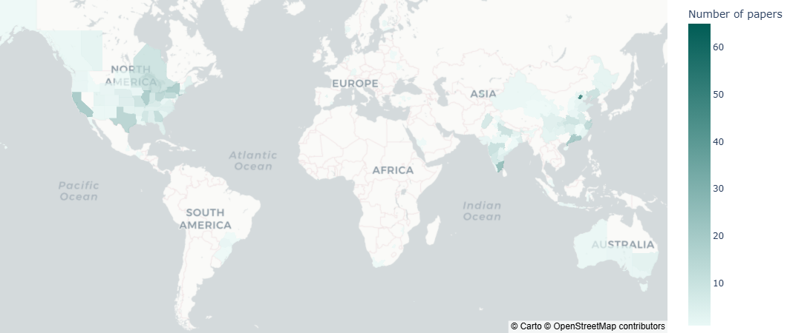

# Mapademic · 脉谱学术 🌍🔭

<p align="center">

</p>

**"Unfold the Map of Discovery" — A Global Visualization Platform for Academic Mobility and Knowledge Evolution**  

---
23/2/2025: Version 0.1

This version of the files output and delivery of the various modules is not yet fully unified; there are bugs in Streamlit run , still debugging.

---
## Table of Contents
- [Project Introduction](#project-introduction)
- [Core Features](#core-features)
- [Tech Stack](#tech-stack)
- [Quick Start](#quick-start)
  - [Installation](#installation)
  - [Configuration](#configuration)
  - [Running](#running)
- [Data Sources](#data-sources)
- [Project Structure](#project-structure)
- [Contribution Guidelines](#contribution-guidelines)
- [License](#license)
- [Acknowledgements](#acknowledgements)
- [Contact Us](#contact-us)

---

## Project Introduction
**Mapademic** is an innovative academic analysis platform that blends modern data visualization techniques to offer a dynamic view of the global academic landscape. It is designed to:

- 🌍 **Visualize Global Research Distribution**:  
  Create interactive maps that display the worldwide spread of academic fields and emerging research hotspots.

- 🏢 **Track Researcher Mobility** (Scheduled):  
  Illustrate scholars' career trajectories and cross-institutional transitions, highlighting the dynamic nature of academic careers.

- 📊 **Reveal Evolutionary Trends**:  
  Use timelines and network graphs to uncover how academic disciplines evolve over time and how collaborations shift across regions.

By leveraging keyword-driven data, Mapademic transforms static academic records into a vibrant, interactive experience—connecting the dots between research institutions, scholar movements, and global knowledge evolution.

---

## Core Features
| Feature Module           | Description                                                                 | Visualization Example                   |
|--------------------------|-----------------------------------------------------------------------------|--------------------------|
| **Academic Distribution Map**    | Global research hotspot heatmap based on geographic distribution, supporting drill-down at province levels. ||
| **Timeline Evolution** (scheduled)  | Slide along the timeline to observe the evolution of academic fields, dynamically rendering the diffusion and decline of hotspots. |                      |
| **Scholar Migration Paths** (scheduled) | Animated "star trails" display the career trajectories of top scholars, supporting comparison of institutional influence. |                      |
| **Personalized Analysis** | Enter keywords (e.g., "quantum computing") to generate a specialized academic pulse report for that field. |                      |

---

## Tech Stack
- **Frontend**: `Streamlit` + `Plotly`(for enhanced interactivity)  
- **Backend**: `Python` (using Pandas/NumPy for data cleaning) 
- **Geovisualization**: `GeoJSON`
- **Data Sources**: ScienceDirect API + Natural Earth administrative boundaries dataset

---

## Quick Start

### Installation
```bash
# Clone the repository
git clone https://github.com/uchicago-2025-capp30122/30122-project-mapademic
cd 30122-project-mapademic

# Create a virtual environment
uv sync
```

### Configuration
1. **Obtain a ScienceDirect API Key**:  
   - Visit the [Elsevier Developer Portal](https://dev.elsevier.com/) to register and apply for an API key.
2. **Set an Environment Variable**:
   ```bash
   #On Linux/MacOS:
   export API_KEY="xxx"

   #On Windows:
   $env:API_KEY = "xxx"
   ```

### Running (scheduled)
```bash
uv run streamlit run src/app/streamlit.py
```
Visit `http://localhost:8501` to begin your exploration!

---

## Data Sources
- **Academic Papers Data**: Retrieved via the [ScienceDirect API](https://dev.elsevier.com/), including metadata such as titles, authors, institutions, keywords, etc.  
- **Geographic Boundary Data**: The 10m-admin-1 administrative boundaries dataset from [Natural Earth](https://www.naturalearthdata.com/).  

---

## Project Structure
```plaintext
Mapademic/
│
├── data/
│   ├── raw/
│   ├── processed/
│   └── example_data.csv
│
├── src/
│   ├── api-calling/
│   │   ├── keyword_search.py
│   ├── cleaning
│   │   ├── clean-data.py
│   │   └── utils.py
│   ├── vis
│   │   └── basci-vis.py
│   └── app/
│       └── streamlit.py
├── docs/
│   ├── pics/
│   └── video/
│
├── tests/
│   ├── test_scraper.py
│   ├── test_visualization.py
│   └── test_app.py
│
├── LICENSE
├── .python-version
├── .gitignore
├── uv.lock
├── pyproject.toml
└── README.md
```

---

## License
This project is licensed under the [MIT License](LICENSE); you are free to use and modify it as long as you retain the original attribution.

---

## Acknowledgements
- **Data Support**: Elsevier ScienceDirect & Natural Earth  
- **Development Team**: Allen Wu, Shiyao Wang, Peiyu Chen, Yue Pan
- **Advisors**: James Turk
---

## Contact Us
- [Allen Wu](https://github.com/songting-byte): API Issues
- [Shiyao Wang](https://github.com/Shiyao-611): Data Analysis
- [Peiyu Chen](https://github.com/Jalkey-Chen): Visualization & Program Management
- [Yue Pan](https://github.com/pppanyue17): Front-end and Interaction

---

**Let the stars of knowledge illuminate the wilderness of human civilization.** ✨

---