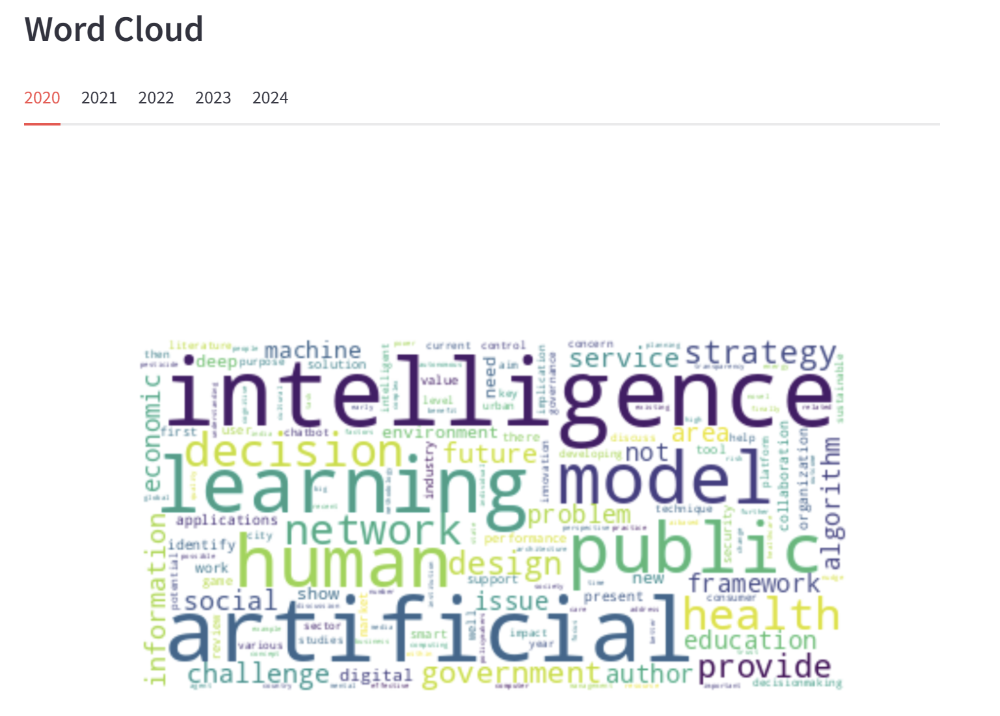
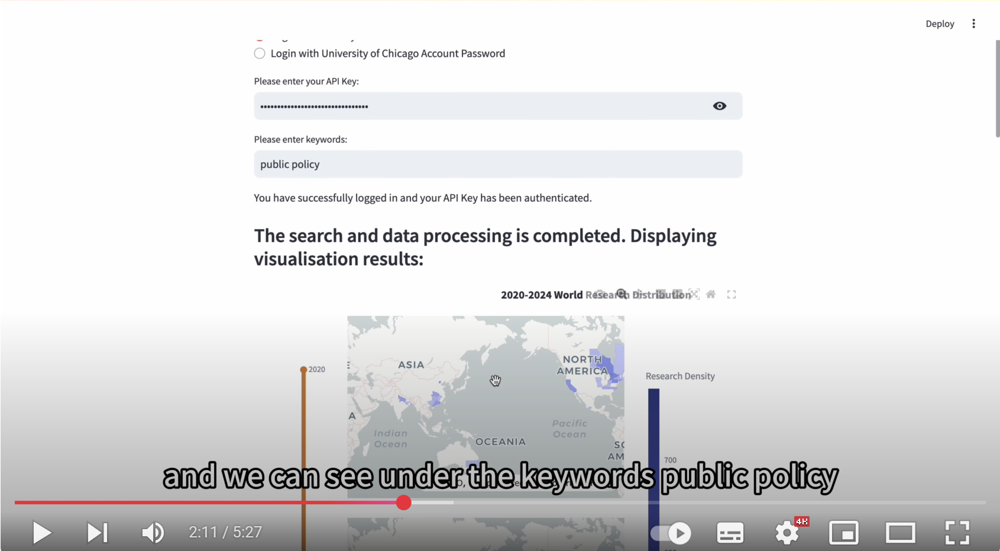

# Mapademic · 脉谱学术 🌍🔭

<p align="center">

</p>

**"Unfold the Map of Discovery" — A Global Visualization Platform for Academic Mobility and Knowledge Evolution**  

---

12/3/2025: Version 0.3

Optimized the interactive interface UI, optimized the logic of heat map hovering display, and supplemented the test files of each part.This is the final delivery version of CAPP 122 Winter 2025.

---

9/3/2025: Version 0.2

We have built a complete Streamlit-based front-end application, including: keyword search, timeline whole map, sub-map by year, word frequency and word cloud analysis, and other basic functions.

This version is used for 30122-Final-Project Presentation Party!🥳

---

23/2/2025: Version 0.1

This version of the files output and delivery of the various modules is not yet fully unified; there are bugs in Streamlit run , still debugging.

---

## Table of Contents
- [Project Introduction](#project-introduction)
- [Core Features](#core-features)
- [Tech Stack](#tech-stack)
- [Quick Start](#quick-start)
  - [Installation](#installation)
  - [Configuration](#configuration)
  - [Running](#running)
- [Data](#data)
  - [Data Sourse](#data-sources)
  - [Model](#model)
- [Project Structure](#project-structure)
- [Introduction Video](#introduction-video)
- [License](#license)
- [Acknowledgements](#acknowledgements)
- [Contact Us](#contact-us)

---

## Project Introduction

**Mapademic 🌍** is an interactive visualization platform that charts the global distribution and temporal dynamics of academic research. By integrating bibliometric analysis with geospatial visualization, Mapademic addresses strategic needs in education 🎓 and industry 🏭.

🔑 **Key Features:**

- 📌 **Interactive Exploration**
- 📈 **Trend Identification**
- ☁️ **Dynamic Visualizations**
- 🖥️ **User-Friendly Interface**

🎯 **Objectives:**
- Assisting students and researchers in identifying geographic regions where and what specific research is concentrated.
- Providing industry stakeholders insights into geographic areas favorable for academic-industry collaboration.

🌟 Driven by the principle that knowledge is a public asset, Mapademic continues to evolve toward becoming a comprehensive global platform to explore academic mobility and knowledge evolution

---

## Core Features
| Feature Module           | Description                                                                 | Example                   |
|--------------------------|-----------------------------------------------------------------------------|--------------------------|
| **Academic Distribution Map**    | Global research hotspot heatmap based on geographic distribution, supporting drill-down at province levels. ||
| **Timeline Evolution** | Slide along the timeline to observe the evolution of academic fields, dynamically rendering the diffusion and decline of hotspots. ||
| **Personalized Analysis** | Enter keywords (e.g., "quantum computing") to generate a specialized academic pulse report for that field. |                      |

---

## Tech Stack
- **Frontend**: `Streamlit` + `Plotly`(for enhanced interactivity)  
- **Backend**: `Python` (using Pandas/NumPy for data cleaning) 
- **Geovisualization**: `GeoJSON`
- **Data Sources**: ScienceDirect API + Natural Earth administrative boundaries dataset

---

## Quick Start

### Installation
```bash
# Clone the repository
git clone https://github.com/uchicago-2025-capp30122/30122-project-mapademic
cd 30122-project-mapademic

# Create a virtual environment
uv sync
```

### Configuration
1. **Obtain a Scopus API Key**:  
   - Visit the [Elsevier Developer Portal](https://dev.elsevier.com/) to register and apply for an API key.

2. **Test**:
```bash
uv run pytest tests/$file_name$
```
All tests should pass!

3. **Set an Environment Variable** (Only for pytest):
   ```bash
   #On Linux/MacOS:
   export API_KEY="xxx"

   #On Windows:
   $env:API_KEY = "xxx"
   ```

### Running
```bash
uv run streamlit run maoademic.py --server.maxMessageSize=1024
```
Visit `http://localhost:8501` to begin your exploration!

---

## Data

### Data Sources
- **Academic Papers Data**: Retrieved via the [ScienceDirect API](https://dev.elsevier.com/), including metadata such as titles, authors, institutions, keywords, etc.  
- **Geographic Boundary Data**: The 10m-admin-1 administrative boundaries dataset from [Natural Earth](https://www.naturalearthdata.com/).

### Model

This model trys to evaluate the research impact of a geographical region based on three key indicators: **Total Paper Density**, **Total Citation Density**, and **Global Quality Coefficient**. These indicators collectively contribute to the **Comprehensive Research Density Index (CRDI)**.

#### **1. Total Paper Density (TPD)**

$$
\text{TPD} = \frac{\sum_{t=0}^{T} \text{Paper Count}_t}{\text{Area}}
$$

This metric measures the density of published research papers within a given region by dividing the total number of papers over a time period $T$ by the geographical area of the region.

#### **2. Total Citation Density (TCD)**

$$
\text{TCD} = \frac{\sum_{t=0}^{T} \text{Citation Count}_t}{\text{Area}}
$$

This indicator reflects the citation density by dividing the total number of citations accumulated within the region over time $T$ by the area. It helps measure the academic influence of the region.

#### **3. Global Quality Coefficient (GQC)**

$$
\text{GQC} = \frac{\sum_{t=0}^{T} \text{Citation Count}_t}{\sum_{t=0}^{T} \text{Paper Count}_t + \epsilon}
$$

The global quality coefficient represents the average citation impact of research papers in the region. A small constant $\epsilon$ is added to prevent division by zero when the total paper count is extremely low.

#### **4. Comprehensive Research Density Index (CRDI)**

$$
\text{CRDI} = \frac{1}{3}\text{TPD} + \frac{1}{3}\text{TCD} + \frac{1}{3}\text{GQC}
$$

This final composite index aggregates the three individual components to provide a comprehensive measure of research density, impact, and quality within a specific region.


---

## Project Structure
```plaintext
Mapademic/
│
├── data/
│   ├── raw_data/
│   │   └── raw_api_data/
│   └── output_data/
│       ├── dynamic_wordfrp/
│       ├── features/
│       ├── institutions/
│       ├── paper/
│       ├── state_crdi/
│       ├── wordcloud/
│       └── word_frq
│
├── src/
│   ├── __init__.py
│   ├── api-calling/
│   │   ├── __init__.py
│   │   ├── keyword_search.py
│   │   └── affiliation_state_match.py
│   ├── cleaning
│   │   ├── __init__.py
│   │   ├── clean-data.py
│   │   ├── feature_selecting.py
│   │   ├── visualize_words_yr.py
│   │   └── utils.py
│   └── visualization
│       ├── __init__.py
│       ├── heatmap.py
│       └── cache_utils.py
│ 
├── docs/
│   └── pics/
│
├── milestones/
│
├── tests/
│   ├── test_api_data.py
│   ├── test_data_clean.py
│   └── test_visualization.py
│
├── LICENSE
├── .python-version
├── .gitignore
├── mapademic.py
├── uv.lock
├── pyproject.toml
└── README.md
```
---

## Introduction Video
[](https://www.youtube.com/watch?v=bWuNfNd4cSs)

---

## License
This project is licensed under the [MIT License](LICENSE); you are free to use and modify it as long as you retain the original attribution.

---

## Acknowledgements
- **Data Support**: Elsevier Scopus & Natural Earth  
- **Development Team**: Allen Wu, Shiyao Wang, Peiyu Chen, Yue Pan
- **Advisors**: [James Turk](https://github.com/jamesturk), [Gregory Mitchell](https://github.com/gregthemitch)
---

## Contact Us
- [Allen Wu](https://github.com/songting-byte): API Issues
- [Shiyao Wang](https://github.com/Shiyao-611): Data Analysis
- [Peiyu Chen](https://github.com/Jalkey-Chen): Visualization & Program Management
- [Yue Pan](https://github.com/pppanyue17): Front-end and Interaction

---

**Let the stars of knowledge illuminate the wilderness of human civilization.** ✨

---